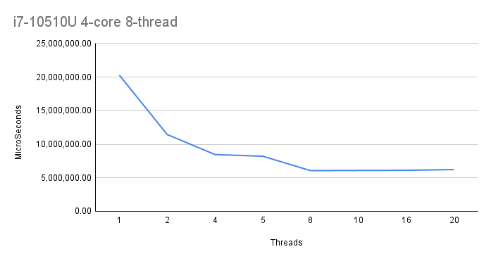
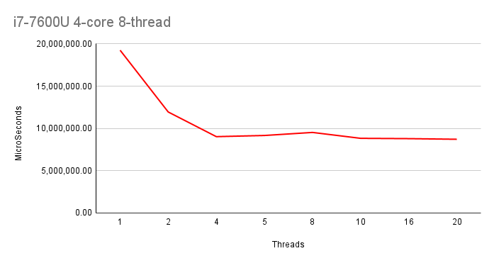
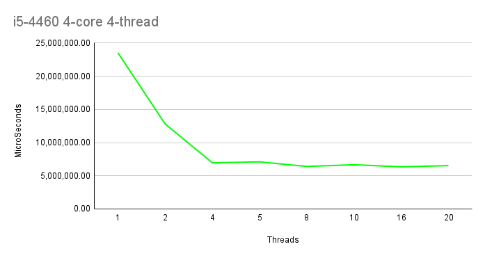
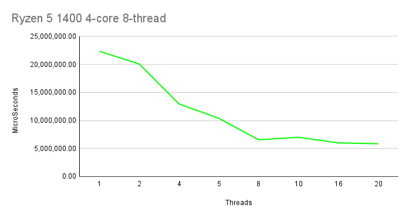
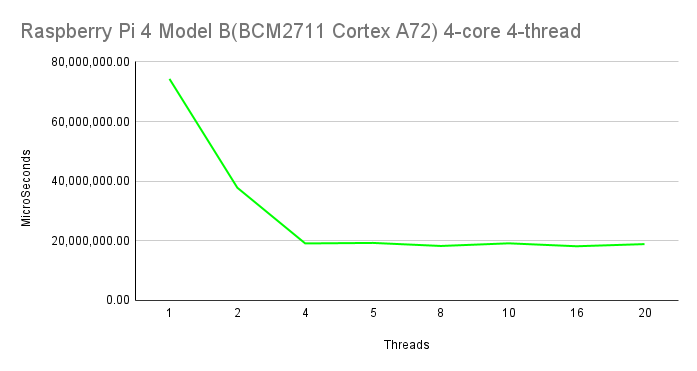
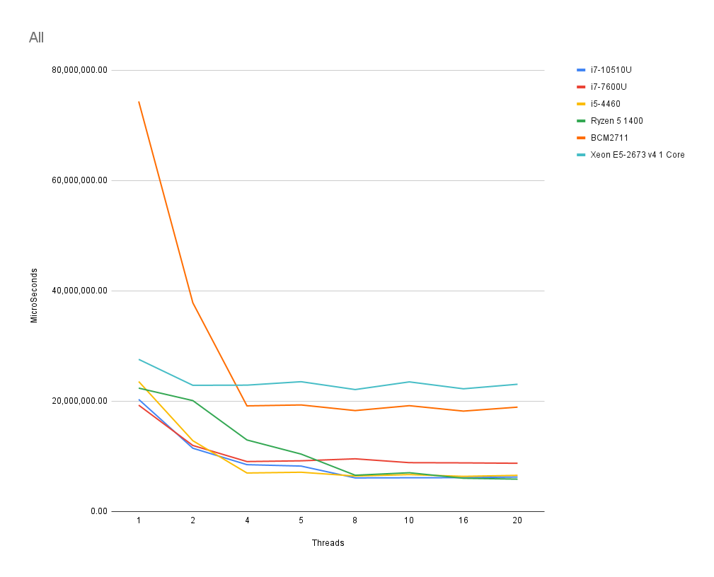

# Lab work 2: Parallel Integral Calculation
Authors (team):
- [Mykhailo Sobko](https://github.com/MykhailoSobko)
- [Ostap Trush](https://github.com/Adeon18)

Variant: 4
## Prerequisites

- gcc or clang
- cmake
- CPU with multiple cores or hyperthreading :D

### Compilation
You can compile using ./compile.sh on Linux and MacOs or CMake on Windows, just make sure that the executable is in <proj_root>/bin directory.

### Installation

For python script:
```
pip install -r requirements.txt
```

### Usage

Usage of python script:
You should specify 2 arguments:

```
python test.py <number of runs> <config_file_path>
```
_This script can also be ran without **python**._

### Results

As expected, the speed of calculations increases dramatically, the more threads the program uses, _but only if the number of threads <= the number of logical CPUs_.

We tested the calculations on different CPUs:
- **i7-10510U**: 4-physical cores, 8-logical cores
- **i7-7600U**: 4-physical cores, 8-logical cores
- **i5-4460**: 4-physical cores, 4-logical cores
- **Ryzen 5 1400**: 4-physical cores, 8-logical cores; L1: 96KB/Core, L2 Total: 2MB, L3 Total: 8 MB; Base: 3.2GHz, Boost: 3.4GHz.
- **BCM2711 ARM Cortex A72**: 4-physical cores, 4-logical cores; 32 KB data + 48 KB instruction L1, 1MB L2; Base: 1.5GHz.

The results were the following:
**i7-10510U**



**i7-7600U**



**i5-4460**



**Ryzen 5 1400**


_What is interesting here is that the calculation speed of the Ryzen barely decreases on 2 threads while all other cpus have nearly 2 times the decrease on 2 threads._ It also loses to all of the Inter Cores, up until 8 threads, where it **ties** the **i7-10510U** and **i5-4460**. I think this might be due to very small boost frequency increase(only 0.2 GHz, while the same **i7-10510U** has an increase of **3.1 GHz**, almost the same as the entire base frequency of the Ryzen!).

**BCM2711 ARM Cortex A72**


_This is the Raspberry Pi 4 Model B CPU._ The only ARM CPU in the experiment and obviously it is slower than every other CPU. Though at **4 cores active** is can reach the speed of 1 logical core of _Intel Cores and Ryzens_. Does not have multithreading, so reaches it's max at 4 threads.

**All on 1 plot**



As you can see, all cpus increase their computation speed dramatically until there is no more logical CPUs than threads, _in that case the speed stays the same as it was for threads = logical CPUs.

We can also see that the **i5-4460** reaches its best result at **4 threads**, because it does not have multithreading, and the result for the 4 threads is better than both i7s. This is because it is not _power efficient(U)_, and has a slightly faster CPU speed(_from [Intel's](https://www.intel.com) official website_), even though it is older. But due to hyperthreading and having 8 logical CPUs with it, **i7-10510U** just barely outruns(_it may be even a time calculation error_) the i5.

_There is also 1 physical(2 logical) cores of Intel Xeon E5-2673 v4. I ran the experiment on Azure VM as a joke :D

# Additional tasks

```
Додаткове завдання (2 бали): дослідити залежність часу виконання від кількості потоків на різних комп’ютерах і з різними наборами параметрів. Порівняти результати та проаналізувати їх. 
```

:)
