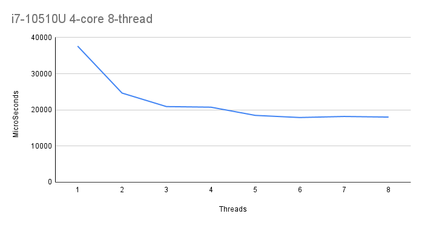
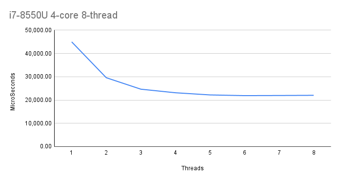
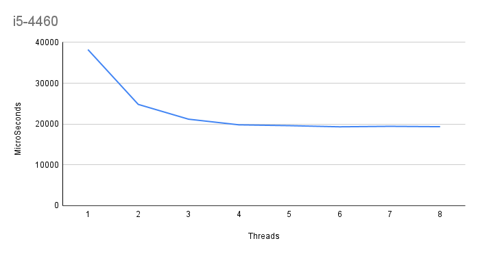
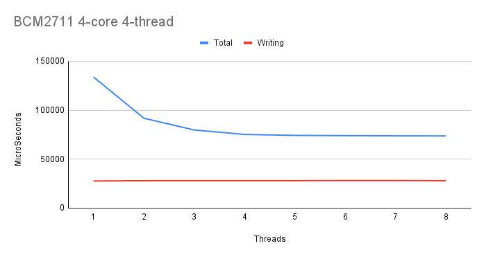
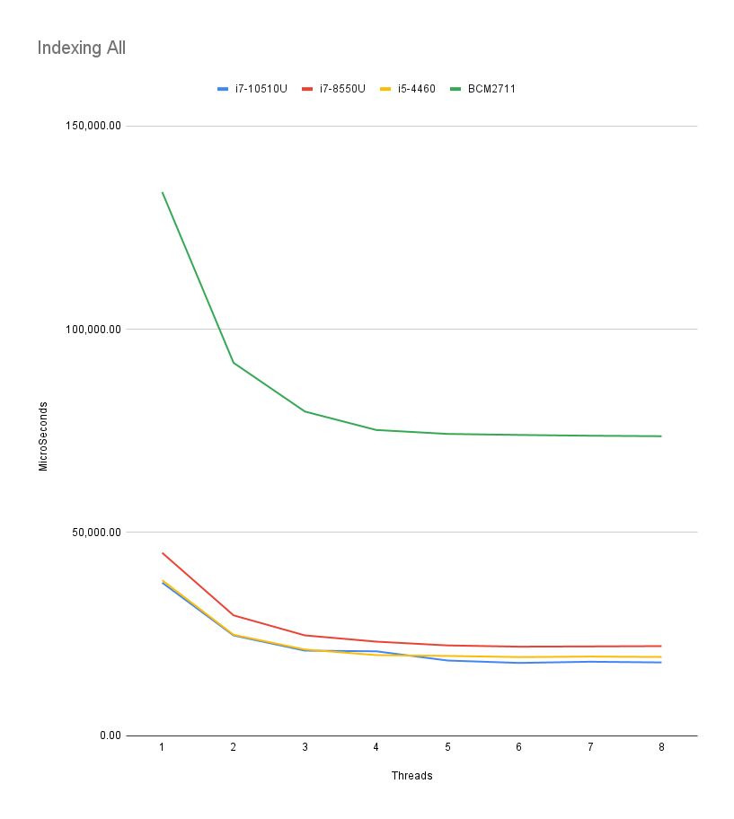

<mark>Template for your README. Remove all unused parts and instructions</mark>

# Lab work 3: Parallel File Indexing
Authors (team):
- [Mykhailo Bondarenko](https://github.com/michael-2956)
- [Bohdan Ruban](https://github.com/iamthewalrus67)
- [Ostap Trush](https://github.com/Adeon18)

Variant: _No Variant for this lab_
## Prerequisites

- gcc
- CMake
- boost
- Preferably a PC with multiple logical cores :D

### Compilation

_Run `./compile.sh` with the needed flags to compile the project(the binary will be in ./bin/)_

### Installation

1. Install all Prerequisites
2. Libs for python script:
```bash
pip install -r requirements.txt
```

### Usage

_The binary takes the config path as its argument._
```bash
./word_indexer <path_to_config_file>
```

_The config file has path to the directory to be indexed, thread count and output paths._
```
indir="data/to_index"     # Директорія для індексації
out_by_a="data/res_a.txt"  # Результати, посортовані за алфавітом
out_by_n="data/res_n.txt"  # Результати, посортовані за кількістю
indexing_threads=3
```

### Important!

_Result files:_
- `res_a.txt`: https://drive.google.com/file/d/1xCyaOBLkz-9x5GYRviyuPRrEAJNLVBdq/view?usp=sharing
- `res_n.txt`: https://drive.google.com/file/d/1qLdp7jj-1cmEKRdv1UBnAL5wqTzZzwLE/view?usp=sharing

### Results

_We have a word indexer program that can index words in parallel._

We tested it on multiple computers to see how it would differ from machine to machine.

Reading is a bottleneck in this lab to begin with, so is writing, that's why there will be hardly any improvement on maximum amount of threads.

The first one is: 

`Intel Core i7-10510U(4-core 8-thread) @1.8Ghz | 16 GB DDR4 | 512 GB NVMe`:


- The improvement can be seen up to 5th thread, even though it starts getting rather small there.
- We see that in comparison to the integrals lab, there is no improvement like: 2x the threads /2 the time. And the time decreases slowly due to a big percentage of the lab being non-parallel
- Overall, on this machine, everything is pretty equal in time decrease, so lets look at other ones.

The next is: 

`Intel Core i7-8550U (4-core 8-thread) @1.8Ghz | 16 GB DDR4 | 512 GB NVMe`:


- This machine has basically same characteristics, but the results are a bit slower.
- It may be because there were more processes running or it was just having a bad day:)

The next machine is more interesting: 

`Intel Core i5-4460(4-core 4-thread) @3.4 GHz | 8 GB DDR3 | SSD / partition(read) HDD /home partition(write)`


- This PC has the / partition(including /mnt dir) on SSD and write dir on HDD.
- The write here was slower, but not by much.

And finally:

`Raspberry Pie 4 Model B | Cortex A72 "BCM2711"(4-core 4-thread) @1.5 Ghz | 4GB LPDDR4 | 64 GB SD Card`


- Even though this bad boy does not perform as well as he did in the integrals lab, matching `i7-10510U @ 2 threads` at 4 threads, it still did decent.
- Since the write drive is an SD card, write takes ~30 seconds which is nearly half of the total runtime.
- It also does not jit the reading bottleneck due to the cpu being more energy saving and having just 4 logical cpus.

_And the side by side comparison:_


- We can see that very different machines perform nearly the same here, and then there is Raspbery Pie:)

# Additional tasks
```
Додаткове завдання - 1 (2 бали): дослідити залежність часу виконання від кількості потоків на різних комп’ютерах і з різними наборами параметрів.
```

