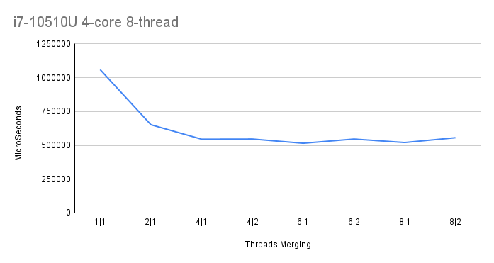

# Lab work 3: Parallel File Indexing and Merging
Authors (team):
- [Mykhailo Bondarenko](https://github.com/michael-2956)
- [Bohdan Ruban](https://github.com/iamthewalrus67)
- [Ostap Trush](https://github.com/Adeon18)

Variant: _No Variant for this lab_
## Prerequisites

- gcc
- CMake 13+
- boost
- libarchive
- Preferably a PC with multiple logical cores :D

### Compilation

_Run `./compile.sh` with the needed flags to compile the project(the binary will be in ./bin/)_

### Installation

1. Install all Prerequisites
2. Libs for python script:
```bash
pip install -r requirements.txt
```

### Usage

_The binary takes the config path as its argument._
```bash
./word_indexer <path_to_config_file>
```

_The config file has path to the directory to be indexed, thread count and output paths._
```
indir="data/to_index"     # Директорія для індексації
out_by_a="data/res_a.txt"  # Результати, посортовані за алфавітом
out_by_n="data/res_n.txt"  # Результати, посортовані за кількістю
indexing_threads=3
merging_threads=1
```

### Important!

_Result files("guttenberg_2020_03_06.iso"):_
- `res_a.txt`: https://drive.google.com/file/d/1e77UJ71FxWmRlpMDX4F98Gc8LLJ-3aFu/view?usp=sharing
- `res_n.txt`: https://drive.google.com/file/d/1FGee0R4ALD-xB70IpfDLLmmyx-dD3caI/view?usp=sharing

_Result Files("guttenberg_2020_03_06.iso" dir 3/):
- `res_a.txt`: https://drive.google.com/file/d/1W_IYyF7q6YoDUu4DkZrxaUoS326ny1IG/view?usp=sharing
- `res_n.txt`: https://drive.google.com/file/d/1s4A8GJ4ksffFMEk4LqcLvdqQXRptjP1f/view?usp=sharing

### Results

We have a program that indexes and unzips files and merges the results in parallel.

The plot:

- We can see that with the increase of the merging threads, the perfomance decreases, but that is due to our implementation of it and since it was ran on a directory 5 of the big archive(1.8 GB).

# Additional tasks

_The Rust implementation is almost done..._

