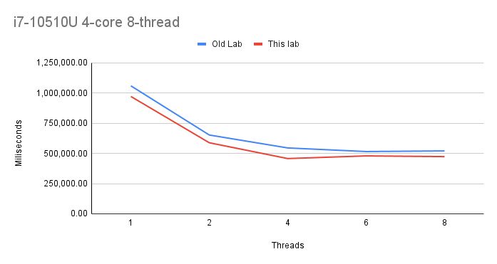

# Lab work 5: Parallel File Indexing and Merging: Other Queues and Maps
Authors (team):
- [Mykhailo Bondarenko](https://github.com/michael-2956)
- [Bohdan Ruban](https://github.com/iamthewalrus67)
- [Ostap Trush](https://github.com/Adeon18)

Variant: _No Variant for this lab_
## Prerequisites

- gcc
- CMake 13+
- boost
- libarchive
- tbb
- qt5
- Preferably a PC with multiple logical cores :D

### Compilation

_Run `./compile.sh` with the needed flags to compile the project(the binary will be in ./bin/)_

### Installation

1. Install all Prerequisites
2. Libs for python script:
```bash
pip install -r requirements.txt
```

### Usage

_The binary takes the config path as its argument._
```bash
./word_indexer <path_to_config_file>
```

_The config file has path to the directory to be indexed, thread count and output paths. And more..._
```
indir="/Volumes/CDROM"     # Директорія для індексації
out_by_a="res_a.txt"  # Результати, посортовані за алфавітом
out_by_n="res_n.txt"  # Результати, посортовані за кількістю
indexing_threads=4

max_file_contents_capacity=100
max_filename_capacity=1000
```

### Important!

_We use concurrent map, so the merging threads parameter is no more..._

_Also, we noticed that UB Sanitizer is mad about our map, but we could not find the error and the core produces the same outputs for 10-20 runs on dir 9 for example(in smaller archive)._

_Moreover, **RESULTS ARE THE SAME AS THE PREVIOUS LAB! YAY! :D**_

_Result files("guttenberg_2020_03_06.iso"):_
- `res_a.txt`: https://drive.google.com/file/d/1d7BEMCCpmKIt7ZG0bGY875g452cRGL8g/view?usp=sharing
- `res_n.txt`: https://drive.google.com/file/d/1MoyVNBT2nkOaJ84I3aEgbrpmT_1hgJEq/view?usp=sharing

### Results

We have a program that indexes and unzips files and merges the results in parallel using 3rd party libs!

The plot: `Intel Core i7-10510U(4-core 8-thread) @1.8Ghz | 16 GB DDR4 | 512 GB NVMe`


- The tbb + QT thread pool are actually faster than our own implementation, but most of the credit for that goes to the thread pool.

:D
