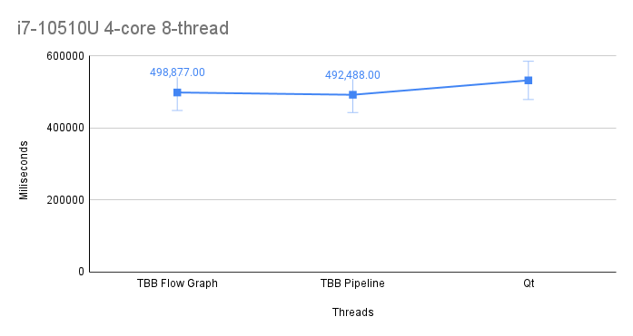

# Lab work 6: Parallel File Indexing and Merging: Other Tools
Authors (team):
- [Mykhailo Bondarenko](https://github.com/michael-2956)
- [Bohdan Ruban](https://github.com/iamthewalrus67)
- [Ostap Trush](https://github.com/Adeon18)

Variant: _No Variant for this lab_
## Prerequisites

- gcc
- CMake 13+
- boost
- libarchive
- tbb
- qt6(should work under qt5)
- facebook folly
- Preferably a PC with multiple logical cores :D

### Compilation

_Run `./compile.sh` with the needed flags to compile the project(the binary will be in ./bin/)_

### Installation

1. Install all Prerequisites
2. Libs for python script:
```bash
pip install -r requirements.txt
```

### Usage

_The binary takes the config path as its argument._
```bash
./word_indexer <path_to_config_file>
```

_The config file has path to the directory to be indexed, thread count and output paths. And more..._
```
indir="/Volumes/CDROM"     # Директорія для індексації
out_by_a="res_a.txt"  # Результати, посортовані за алфавітом
out_by_n="res_n.txt"  # Результати, посортовані за кількістю
indexing_threads=4

max_file_contents_capacity=100
max_filename_capacity=1000
```

### Important!

_This lab has **FOUR** implementations:_
- _tbb: flow graphs_ - [branch link](https://github.com/ucu-cs/lab6_words_count_4-ruban_bondarenko_trush/tree/TBB_flow_graphs)
- _tbb: parallel pipeline_ - [branch link](https://github.com/ucu-cs/lab6_words_count_4-ruban_bondarenko_trush/tree/TBB_pipeline)
- _Facebook folly_ - [branch link](https://github.com/ucu-cs/lab6_words_count_4-ruban_bondarenko_trush/tree/i_love_folly)
- _Qt_ - [branch link](https://github.com/ucu-cs/lab6_words_count_4-ruban_bondarenko_trush/tree/i_hate_qt)

### Results

_We have our word count with different libs. Some of the code(Qt....) may be a bit stupid though._

_Here are our results:_



- Folly could not be executed because it only runs on ubuntu and this Laptop does not have ubuntu:( Other laptop had it but it has a different CPU.

# Additional tasks
_**ALL OF THEM!!!!**_
```asm
Повторити із використанням додаткових засобів із списку вище.

+3 бали за перший

+2 за другий

+1 за третій
```
_we hope at least..._

:)